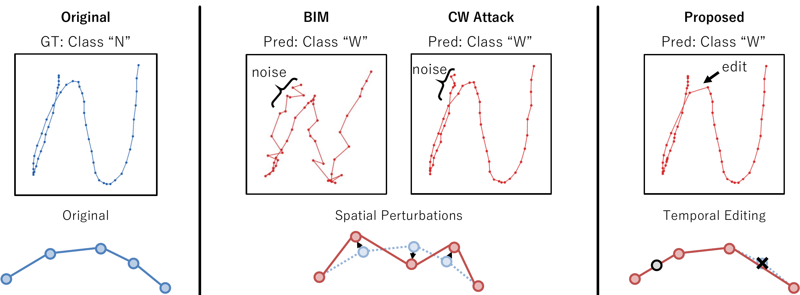

# Adversarial Attacks on Online Handwriting using Salience-based Temporal Editing

<p align="center">
  <a href="https://link.springer.com/chapter/TODO"></a>
  <a href="https://arxiv.org/abs/2607.12500"></a>
  <a href="LICENSE"></a>
  
  
</p>

<p align="center">
  
</p>

> **AITE** (Adversarial Iterative Temporal Editing) attacks online handwriting recognizers by **inserting and deleting points** along the pen trajectory — guided by Grad-CAM salience — rather than adding pixel-wise noise. This preserves stroke shape while achieving strong black-box transferability across CNN, BLSTM, and Transformer targets.


## Installation

**Requirements:** Python ≥ 3.9, PyTorch ≥ 2.0, CUDA 11.8+ (≥ 6 GB VRAM recommended).

```bash
git clone https://github.com/yataro0117/AITE.git
cd AITE
pip install -e .
```

To pin exact versions for full reproducibility:

```bash
pip install torch==2.3.0 torchvision==0.18.0 --index-url https://download.pytorch.org/whl/cu118
pip install -e ".[dev]"
```

---

## Citation

```bibtex
@inproceedings{tamura2026aite,
  title     = {Adversarial Attacks on Online Handwriting using Salience-based Temporal Editing},
  author    = {Tamura, Yataro and Iwana, Brian Kenji and Lee, Jiseok},
  booktitle = {Proceedings of the International Conference on Document Analysis and Recognition (ICDAR)},
  year      = {2026},
  eprint    = {2607.12500},
  archivePrefix = {arXiv},
  primaryClass  = {cs.CV}
}
```

---

## License

This project is released under the [Apache-2.0 License](LICENSE).
See [NOTICE](NOTICE) for third-party attributions (CleverHans, Pialla et al. smoothness metric).
